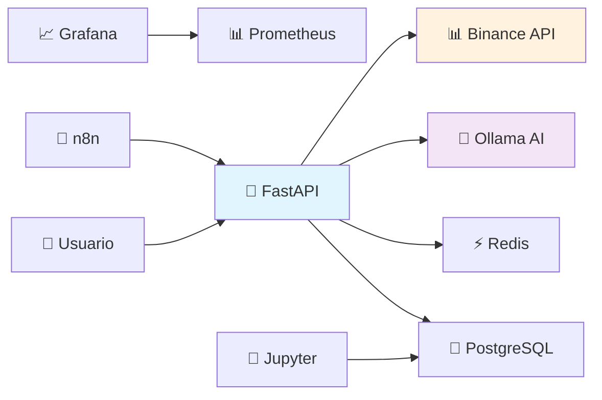

# 🤖 IA-AGENTS
## Sistema de Trading Inteligente Multi-Asistente

[
cp env.example .env

# 2. Editar .env con TUS credenciales reales
nano .env

# 3. NUNCA subir .env al repositorio (está en .gitignore)
```

### Variables de Entorno (`.env`)
```bash
# Trading Configuration (EDITAR CON TUS CREDENCIALES)
BINANCE_API_KEY=tu_api_key_aqui         # ⚠️ Usar tus credenciales reales
BINANCE_API_SECRET=tu_secret_aqui       # ⚠️ Usar tus credenciales reales
BINANCE_TESTNET=true                    # ✅ Modo seguro
TRADING_ENABLED=false                   # ✅ Paper trading
DEFAULT_SYMBOL=SOLUSDT                  # Par de trading

# Paper Trading
PAPER_TRADING_INITIAL_BALANCE=10000.0   # Balance inicial virtual
PAPER_TRADING_TRANSACTION_FEE=0.001     # Comisión simulada

# AI Learning
LEARNING_CONFIDENCE_THRESHOLD=0.6       # Umbral de confianza
LEARNING_MIN_TRADES=5                   # Trades mínimos para aprender

# Contraseñas de Servicios (CAMBIAR POR SEGURIDAD)
N8N_BASIC_AUTH_PASSWORD=tu_password_n8n     # ⚠️ Cambiar
JUPYTER_TOKEN=tu_token_jupyter              # ⚠️ Cambiar  
GF_SECURITY_ADMIN_PASSWORD=tu_password_grafana # ⚠️ Cambiar
```calhost:8000/docs)
[](http://localhost:8000/docs)
[](docker-compose.yml)
[](http://localhost:11434)

**Sistema de trading automatizado con múltiples asistentes de IA que colaboran para tomar decisiones inteligentes.**

---

## ✅ Estado Actual

**🎉 SISTEMA COMPLETAMENTE OPERATIVO - 28 de Agosto, 2025**

- ✅ **8 servicios ejecutándose** correctamente
- ✅ **API completamente funcional** con 15+ endpoints
- ✅ **Paper trading operativo** para pruebas sin riesgo
- ✅ **Sistema de aprendizaje** activo y mejorando
- ✅ **Dashboards y monitoreo** configurados
- ✅ **Base de datos** inicializada y poblada

## 🚀 Inicio Rápido (2 minutos)

### 1. Verificar Prerequisitos
```bash
# Verificar Docker
docker --version
docker-compose --version
```

### 2. Lanzar Sistema
```bash
# Sistema ya está ejecutándose, verificar estado:
docker-compose ps

# Si no está ejecutándose:
docker-compose up -d
```

### 3. Acceder al Sistema
- **📚 Documentación API:** http://localhost:8000/docs
- **📈 Dashboard Trading:** http://localhost:3000
- **🔄 Automatización:** http://localhost:5678
- **📓 Análisis de Datos:** http://localhost:8888

---

## 🎯 Funcionalidades Principales

### 💰 Paper Trading (Sin Riesgo)
```bash
# Ver tu portafolio virtual ($10,000 iniciales)
curl http://localhost:8000/api/paper-trading/portfolio

# Realizar tu primer trade virtual
curl -X POST http://localhost:8000/api/paper-trading/order \
  -H "Content-Type: application/json" \
  -d '{"symbol": "SOLUSDT", "side": "BUY", "quantity": 10, "order_type": "MARKET"}'
```

### 📊 Datos de Mercado en Tiempo Real
```bash
# Obtener datos de SOLUSDT
curl "http://localhost:8000/api/trading/klines?symbol=SOLUSDT&limit=100"
```

### 🧠 Sistema de Aprendizaje
```bash
# Ver métricas de aprendizaje
curl http://localhost:8000/api/learning/metrics

# Entrenar modelo con nuevos datos
curl -X POST http://localhost:8000/api/learning/train \
  -H "Content-Type: application/json" \
  -d '{"symbol": "SOLUSDT", "epochs": 10}'
```

---

## 🏗️ Arquitectura del Sistema



### 🛠️ Stack Tecnológico
- **Backend:** FastAPI (Python) con endpoints REST completos
- **Base de Datos:** PostgreSQL con esquema optimizado para trading
- **Cache:** Redis para sesiones y datos temporales
- **IA Local:** Ollama para decision-making sin dependencias externas
- **Monitoreo:** Grafana + Prometheus con dashboards configurados
- **Automatización:** n8n para workflows de trading
- **Análisis:** Jupyter Notebooks para investigación
- **Containerización:** Docker Compose con 8 servicios orquestados

---

## 📡 API Endpoints Disponibles

### 🏥 Sistema
- `GET /api/health` – Estado del sistema
- `GET /docs` – Documentación interactiva

### 📈 Trading
- `GET /api/trading/klines` – Datos de mercado (velas)
- `GET /api/trading/features` – Indicadores técnicos
- `GET /api/trading/signals` – Señales de IA

### 💰 Paper Trading
- `GET /api/paper-trading/portfolio` – Estado del portafolio
- `POST /api/paper-trading/order` – Realizar trade virtual
- `GET /api/paper-trading/orders` – Historial de órdenes
- `GET /api/paper-trading/performance` – Métricas de rendimiento

### 🧠 Aprendizaje
- `GET /api/learning/metrics` – Métricas del sistema
- `POST /api/learning/train` – Entrenar modelo
- `GET /api/learning/predictions` – Obtener predicciones

---

## 🔧 Configuración

### Variables de Entorno (`.env`)
```bash
# Trading Configuration
BINANCE_TESTNET=true                    # ✅ Modo seguro
TRADING_ENABLED=false                   # ✅ Paper trading
DEFAULT_SYMBOL=SOLUSDT                  # Par de trading

# Paper Trading
PAPER_TRADING_INITIAL_BALANCE=10000.0   # Balance inicial virtual
PAPER_TRADING_TRANSACTION_FEE=0.001     # Comisión simulada

# AI Learning
LEARNING_CONFIDENCE_THRESHOLD=0.6       # Umbral de confianza
LEARNING_MIN_TRADES=5                   # Trades mínimos para aprender
```

### Servicios y Puertos
| Servicio | Puerto | URL | Credenciales |
|----------|--------|-----|--------------|
| API | 8000 | http://localhost:8000 | - |
| Grafana | 3000 | http://localhost:3000 | admin/grafana_admin |
| n8n | 5678 | http://localhost:5678 | admin/n8n_password |
| Jupyter | 8888 | http://localhost:8888 | token: jupyter_token_123 |
| Prometheus | 9090 | http://localhost:9090 | - |

---

## 👥 Sistema Multi-Asistente (En desarrollo)

### 🤖 Asistentes de IA Planificados
1. **👁️ Monitor de Mercado** - Vigilancia 24/7 de precios y volúmenes
2. **🔍 Analista Técnico** - Análisis de patrones y indicadores
3. **📰 Analista Fundamental** - Análisis de noticias y eventos
4. **⚠️ Gestor de Riesgo** - Protección de capital y gestión de posiciones
5. **🎯 Estratega** - Coordinación y toma de decisiones
6. **⚡ Ejecutor** - Ejecución automática de órdenes
7. **🔍 Auditor** - Revisión y validación de todas las operaciones

---

## 📚 Documentación Completa

### 📖 Guías Principales
- **[🚀 Guía de Inicio Rápido](docs/QUICK_START_GUIDE.md)** - Comienza en 5 minutos
- **[📡 API Reference](docs/API_REFERENCE.md)** - Documentación completa de endpoints
- **[⚙️ Guía de Deployment](docs/DEPLOYMENT_GUIDE.md)** - Configuración y deployment
- **[🐳 Docker Configuration](docs/DOCKER_CONFIGURATION.md)** - Configuración de contenedores

### 📋 Documentación Técnica
- **[🏗️ Arquitectura Técnica](docs/TECHNICAL_ARCHITECTURE.md)** - Diseño del sistema
- **[🤖 Especificaciones de IA](docs/AI_ASSISTANTS_SPECS.md)** - Detalles de asistentes
- **[🧪 Testing y Aprendizaje](docs/AUTOMATED_TESTING_LEARNING.md)** - Sistema de mejora continua

---

## 🧪 Testing y Validación

### Tests Automáticos
```bash
# Ejecutar test suite completo
python test_docker_system.py

# Test específico de trading
python test_trading_system.py

# Test de conectividad
curl http://localhost:8000/api/health
```

### Validación Manual
```bash
# 1. Verificar servicios
docker-compose ps

# 2. Test de API
curl http://localhost:8000/api/trading/klines?symbol=SOLUSDT&limit=5

# 3. Test de paper trading
curl http://localhost:8000/api/paper-trading/portfolio

# 4. Test de aprendizaje
curl http://localhost:8000/api/learning/metrics
```

---

## 🛠️ Comandos Útiles

### Gestión del Sistema
```bash
# Ver estado de todos los servicios
docker-compose ps

# Ver logs en tiempo real
docker-compose logs -f

# Reiniciar un servicio
docker-compose restart api

# Actualizar sistema
git pull && docker-compose up -d --build
```

### Debugging
```bash
# Acceder a la base de datos
docker exec -it ia-agents-postgres psql -U ia_user ia_agents

# Ver logs de un servicio específico
docker logs ia-agents-api

# Verificar conectividad de red
docker network inspect ia-agents_ia-agents-network
```

---

## ⚠️ Importante - Seguridad

### ✅ Configuración Actual (Segura)
- **🛡️ Testnet Binance:** Sin dinero real en riesgo
- **💰 Paper Trading:** Todas las operaciones son virtuales
- **🔒 Modo Desarrollo:** Trading real deshabilitado por defecto

### 🚨 Para Uso en Producción
```bash
# ⚠️ SOLO cuando estés completamente seguro
BINANCE_TESTNET=false
TRADING_ENABLED=true
```

**⚠️ ADVERTENCIA:** Este sistema es para educación y desarrollo. No es asesoría financiera. Opera bajo tu propio riesgo y responsabilidad.

---

## 🎉 ¡Sistema Listo!

**El sistema IA-AGENTS está completamente operativo y listo para usar.**

1. **Abre:** http://localhost:8000/docs
2. **Explora:** Los endpoints disponibles  
3. **Prueba:** Tu primer paper trade
4. **Aprende:** Con los dashboards y notebooks
5. **Automatiza:** Con workflows en n8n

**¡Bienvenido al futuro del trading con IA!** 🚀🤖📈

---

## 📞 Soporte

- **Documentación:** http://localhost:8000/docs
- **Issues:** GitHub Issues
- **Logs:** `docker-compose logs -f`
- **Status:** `docker-compose ps`

**Made with ❤️ and AI**